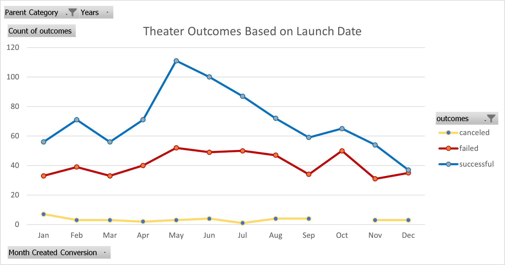
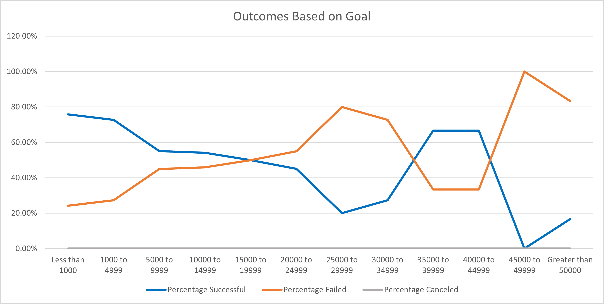

# An Analysis of Kickstarter Campaigns
Performing Analysis on Kickstarter data to uncover trends within film, video and television industry
## Overview of Project
Crowdfunding can be an alternative and somewhat more popular way of getting projects the necessary funding it needs to its target audience. Kickstarter is one such crowdfunding platform where creators can propose a project in order to have regular consumers back (fund) the project with their own money. Not all projects are successful; some can miss the funding goal either by a wide or small margin, the date for when the Kickstarter ends had passed, or it simply got canceled. In this particular dataset, Louise has gathered Kickstarter data from the last few decades or so to truly see just how much of an influence crowdfunding can be so she can make calculated decisions on her campaign with confidence. Louise's own play "Fever" almost reached its goal within a short period of time thus leading to this analysis of wanting to see other campagins success relative to its launch vs end date. The purpose of this particualr dataset is to analyze the outcomes for certain projects based on filters including year, category/ subcategory, and outcome in order to make Lousie's campaign goals and pledging into successful outcomes
## Analysis and Challenges
There are quite a few, effective ways to analyze a dataset especially one with as many filters as this Kickstarter data sets. Through the use of tools such as creating PivotCharts, line and box-and-whisker charts, we can develop logistical conclusions in determining how certain filters positively or negatively affect each other.

### Theater Outcomes Based on Launch Date

Based on the chart labeled "Theater Outcomes Based on Launch data, we filter the dataset by the number of successful, failed and canceled outcomes. According to the chart, we can see the highest number of successful outcomes peaked in the month of May but saw a a rapid decline back to March levels of success. An observation can be made inferring that May was probably the most successful in terms of theaters meeting their crowdfunding goals due to the warm weather. This inference can also be applied to the later months of summer (June through September) as we can see, despite the decline, these months still had high successful outcomes therefore people are interested in activities in warmer months. 

The number of failed campaigns stayed relatively close to each other in terms of number per month. This could be that not all theater campaigns cater to everyones specifc tastes. It is difficult to gauge every individual's personal tastes or it could be other factors that led to failed outcomes such as not meeting its goal within its crowdfunding period/ The number of canceled outcomes stayed below 10% throughout the calendar year, the highest being in the month of January. Some possible reasons for cancelations could be the project never fully developed beyond its crowdfunding initiative but there is no real way to determine the cause.

### Outcomes Based on Goals

An immediate observation based on this chart labeled "Outcomes Based on Goals," is that there were virtually no play cancelations. As we can see according to the legend, the line labeled "perecentage canceled" shows a relatively flat line throughout. Based off of this observation, we can assume the filtered data in this particular dataset met their crowdfunding goals. In terms of the "percentage successful" vs "percentage failed," we can observe that campaigns with goals under $15,000 saw the most successful outcomes and the lowest percantage of failed campaigns but inversely, goals above $45,000 saw the least amount of success and saw the greatest amoung of failed campaigns.

### Challenges of the Dataset

A particular challenge of this dataset is that besides offering a statistical analysis of outcomes, it offers no other real reasons why some campaigns failed. Some kickstarter campaigns offer incentives at certain goal stretches which could entice people to give more funding to the campaign in order to obtain said incentives. There is no way of knowing how much advertising was done outside the campaign in order to obtain funding which could also factor into a campaigns outcome. There are unknown variables outside the dataset that could have had some impact on a campaigns outcome.
## Results
What are two conclusions you can draw about the Theater Outcomes by Launch Date?

One observable conclusion we can make about the "Theater Outcomes by Launch Date" is that the month of May saw the highest number of successful outcomes. This is also noticeable in the line graph as we see the peak clearly visible in the month of May. Another observable conclusion is that the percentage of canceled outcomes stayed below 10% throughout the calendar year thus informing us that a very low percantage of campaigns were outright canceled.

What can you conclude about the Outcomes based on Goals?

Based off of the chart generated, we can conclude that the greater the crowdfunding goal of a campaign, the greater the chance of it failing or not reaching its goal within the crowdfunding period. The more attainable the goal is, the greater the chance of it being successful.

What are some limitations of this dataset?

One limitation of the dataset is that it only concerns itself with whether or not a Kickstarter campaign failed, was successful or canceled. It does not consider other variables that could have affected a campaign such as lack of advertisement contributing to an outcome of a campaign. Another could be factoring the backgrounds of the people supporting these campaigns in order to gauge which group of people from a certain background contribute more or a less to category within film and television.

What are some other possible tables and/or graphs that we could create?

One possible graph we can make is a Box and Whiskers Plot using the fltered dataset of successful, failed and canceled outcomes in order to view any outliers to the dataset and see how skewedthey might have contributed to the overall dataset. We can also create another PivotChart to compare the outcomes between the Parent Category and Subcategory in order to determine a possble relationship between a specific category leading to certain favorable outcomes.
